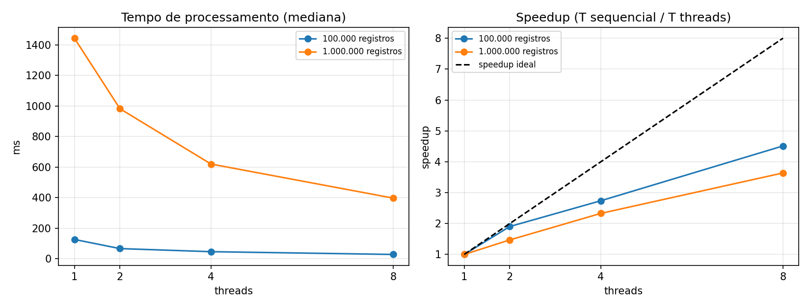

# Pipeline de CI/CD, deploy e processamento concorrente — Rota Vital / Código Vermelho

## 1. Pipeline de CI/CD

**Fluxo:** Código → GitHub (push na main) → GitHub Actions → Build (Maven, JDK 17) → Testes (mvn test) → Deploy automático (Render) → Aplicação disponível.

Definido em `.github/workflows/build.yml`:

- Job `build`: compila o backend e roda a suíte de testes.
- Job `deploy`: só executa se `build` passar e apenas em push direto na branch `main` (nunca em Pull Request, para não publicar código ainda não revisado). Dispara o deploy chamando o Deploy Hook do Render.

## 2. Deploy

- **Serviço:** Render (plano free), Web Service via Docker (`backend/Dockerfile`).
- **Root Directory:** `backend`.
- **Como é disparado:** o workflow chama, via `curl`, uma URL secreta do Render (`RENDER_DEPLOY_HOOK_URL`, guardada em GitHub Secrets) depois que o build e os testes passam.
- **Aplicação disponível em:** `https://<codigo-vermelho>.onrender.com`.
- **Banco de dados:** H2 em memória, embutido na própria aplicação — sem infraestrutura externa.

Detalhes completos em `docs/DEPLOY.md`.

## 3. Processamento concorrente — processo real

### Operação escolhida

**Cálculo de score de risco/prioridade** de cada requisição do histórico — usado, na prática, para decidir a ordem de atendimento no Rota Vital. Para cada requisição, o score combina gravidade, tempo de espera, distância e disponibilidade de estoque, com um ajuste fino baseado em funções trigonométricas (cálculo de negócio real, não um laço artificial de espera).

Endpoint: `GET /api/v1/processamento/score-risco`

| Parâmetro | Valores | Padrão |
|---|---|---|
| `registros` | de 1 a 5.000.000 | `100000` |
| `modo` | `sequencial` ou `threads` | `sequencial` |
| `threads` | `2`, `4` ou `8` | `2` |

Resposta: `modo`, `threads`, `registros`, `mediaScore`, `quantidadeCriticos` (requisições acima do limiar de urgência) e `tempoProcessamentoNanos`.

### Big-O e particionamento

- **Sequencial:** uma passada pelo vetor, calculando o score de cada requisição. **O(n)**.
- **Particionável:** cada thread calcula os scores da sua fatia de forma totalmente independente e devolve só dois números — soma parcial dos scores e contagem parcial de casos críticos. **Não há ordenação nem merge de arrays**: a agregação final é uma soma de no máximo 8 números, O(p), desprezível diante de O(n).
- **Sem race condition:** cada thread lê os dados de entrada (imutáveis após gerados) e escreve apenas no seu próprio acumulador local; a soma dos acumuladores parciais acontece em uma única thread, depois que todas as tarefas terminam (`executor.invokeAll`, que bloqueia até a conclusão de todas).

### Corretude

O teste `ScoreRiscoServiceTest` compara os resultados entre sequencial e threads (2, 4 e 8), com 4 casos. A contagem de requisições críticas (`quantidadeCriticos`) é comparada por igualdade exata; a média do score é comparada com uma tolerância pequena (1e-6), porque a soma de números `double` em ordens diferentes pode variar na última casa decimal — reassociação de ponto flutuante, não um sinal de concorrência insegura. Nas medições reais abaixo, `quantidadeCriticos` foi **idêntico** em todas as configurações do mesmo tamanho (89.650 para 100 mil registros; 896.022 para 1 milhão), confirmando que não há race condition.

### Medições

**Protocolo:** 3 chamadas de aquecimento e 10 chamadas medidas por configuração; usamos a mediana. Máquina com 10 núcleos e 12 processadores lógicos, servidor local, medição por script PowerShell.

| Registros | Sequencial (ms) | 2 threads (ms) | Speedup 2 | 4 threads (ms) | Speedup 4 | 8 threads (ms) | Speedup 8 |
|---:|---:|---:|---:|---:|---:|---:|---:|
| 100.000 | 126,322 | 66,343 | 1,90 | 46,129 | 2,74 | 27,996 | 4,51 |
| 1.000.000 | 1444,351 | 982,456 | 1,47 | 620,096 | 2,33 | 396,932 | 3,64 |

### Análise

Ao contrário de uma operação leve (como soma simples), aqui o ganho de threads é real e cresce com o número de threads: com 100 mil registros e 8 threads, o speedup chega a 4,51×; com 1 milhão, a 3,64×. A diferença entre os dois tamanhos mostra outro ponto importante: com mais dados, o speedup com 8 threads cai um pouco em relação ao de 100 mil — plausível porque o trabalho por thread cresce e a pressão sobre cache e memória aumenta, mas o ganho continua forte em ambos os casos.

O ganho não é perfeitamente linear (não chega a 2×, 4× e 8× exatos) porque sempre há um custo de coordenação — dividir o trabalho em tarefas, despachá-las ao pool e agregar os resultados parciais no final — mas, diferente de uma operação leve, aqui o trabalho por item é grande o bastante para que esse custo seja pequeno frente ao ganho. Isso ilustra a Lei de Amdahl no sentido oposto ao observado antes: quando a fração paralelizável do trabalho é grande e o custo fixo de coordenação é proporcionalmente pequeno, o paralelismo compensa.

A Big-O não muda entre as versões (ambas O(n)); o que muda é o tempo decorrido, porque o trabalho é distribuído entre núcleos físicos diferentes, rodando de fato ao mesmo tempo — paralelismo, não apenas concorrência.

Quando o volume crescer ainda mais, o caminho de evolução continua sendo sair de uma única JVM: processar os scores em lote, de forma assíncrona, com workers escaláveis horizontalmente, mantendo os resultados em cache ou em uma tabela de prioridades já calculada, em vez de recalcular tudo a cada requisição.