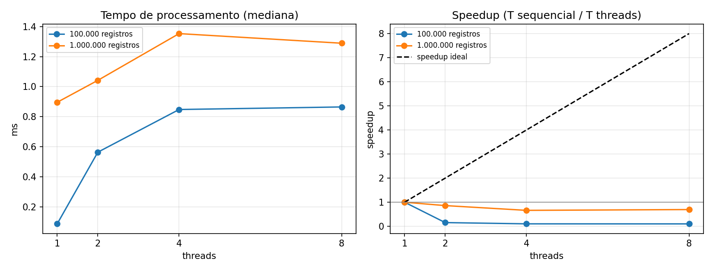

# Análise concorrente do consumo — Rota Vital / Código Vermelho

## 📌 Entrega 23/09

## 1. Justificativa

### Operação escolhida

Painel descritivo US06: estatísticas agregadas de um histórico de consumo — soma, média, variância, desvio padrão e coeficiente de variação. Na escala nacional, é um relatório que pode atravessar milhões de registros de hospitais, calculado sobre dados já carregados na camada de aplicação.

### Candidatas avaliadas

| Operação | Onde o tempo é gasto | Big-O | Particionável | Decisão |
|---|---|---|---|---|
| Estatísticas agregadas do histórico (soma, média, variância) | Cálculo sobre dados já em memória (CPU) | O(n) | Sim, por soma parcial | **Escolhida** |
| Cruzamento requisições × estoque | Depende do JOIN e dos índices no banco | — | — | Descartada: gargalo é a consulta SQL |
| Ordenação de filas por prioridade | CPU | O(n log n) | Sim, por fatias e merge | Investigada em paralelo a esta entrega (ver observação ao fim da análise); não incluída no serviço final por falta de tempo para diagnosticar uma lentidão inesperada |
| Detecção de duplicatas | Estrutura de hash global, sensível a memória | O(n) | Parcialmente | Descartada |
| Validações em lote | Trabalho por registro muito leve | O(n) | Sim | Descartada: risco de custo de coordenação superar o ganho |

### Big-O e gargalo

- **Sequencial:** soma e soma dos quadrados são calculadas em uma única passada pelo vetor. **O(n)** de tempo, O(1) de espaço adicional.
- **Gargalo:** processamento. Os dados já estão na camada de aplicação (gerados em memória) e o tempo medido é gasto calculando, sem esperar banco ou rede.
- **Particionável:** soma e soma dos quadrados são aditivas entre fatias disjuntas. Cada tarefa processa só a sua fatia contígua, sem escrita compartilhada, e a thread que atende a requisição agrega os resultados parciais só ao final. Como as somas usam `long` (inteiros), o resultado é exato e idêntico, em qualquer ordem de agregação — não há race condition.
- **Com p threads:** cada fatia é processada em O(n/p); a agregação final custa O(p), desprezível.

## 2. O serviço

`GET /api/v1/analises/consumo`

| Parâmetro | Valores | Padrão |
|---|---|---|
| `registros` | de 1 a 5.000.000 | `100000` |
| `modo` | `sequencial` ou `threads` | `sequencial` |
| `threads` | `2`, `4` ou `8` | `2` |

Exemplos:

```text
GET http://localhost:8080/api/v1/analises/consumo?registros=100000&modo=sequencial
GET http://localhost:8080/api/v1/analises/consumo?registros=1000000&modo=threads&threads=8
```

Resposta: `modo`, `threads`, `registros`, `somaConsumo`, `media`, `variancia`, `desvioPadrao`, `coeficienteVariacao` e `tempoProcessamentoNanos`.

Os dados são sintéticos e determinísticos, então todas as versões processam exatamente a mesma entrada.

### Corretude

O teste `AnaliseConsumoServiceTest` compara todos os campos da resposta entre o modo sequencial e o modo com threads (2, 4 e 8), e passa: soma, média, variância, desvio padrão e coeficiente de variação são idênticos em todas as configurações, confirmando que não há race condition.

## 3. Medições

**Protocolo:** 3 chamadas de aquecimento e 10 chamadas medidas por configuração; usamos a mediana. Máquina com 10 núcleos e 12 processadores lógicos, servidor local, medição por script PowerShell. Speedup = tempo sequencial / tempo com threads.

**Tempo de processamento no servidor (`tempoProcessamentoNanos`)**

| Registros | Sequencial (ms) | 2 threads (ms) | Speedup 2 | 4 threads (ms) | Speedup 4 | 8 threads (ms) | Speedup 8 |
|---:|---:|---:|---:|---:|---:|---:|---:|
| 100.000 | 0,087 | 0,564 | 0,15 | 0,848 | 0,10 | 0,865 | 0,10 |
| 1.000.000 | 0,896 | 1,042 | 0,86 | 1,353 | 0,66 | 1,289 | 0,69 |

**Tempo de resposta do endpoint (visto pelo cliente)**

| Registros | Sequencial (ms) | 2 threads (ms) | Speedup 2 | 4 threads (ms) | Speedup 4 | 8 threads (ms) | Speedup 8 |
|---:|---:|---:|---:|---:|---:|---:|---:|
| 100.000 | 2,407 | 3,528 | 0,68 | 3,595 | 0,67 | 3,256 | 0,74 |
| 1.000.000 | 8,326 | 10,006 | 0,83 | 9,670 | 0,86 | 10,460 | 0,80 |



O gráfico usa o tempo de processamento no servidor. A linha tracejada é o speedup ideal; a linha horizontal em 1,0 marca o ponto de equilíbrio entre sequencial e threads.

## 4. Análise

Nenhuma configuração com threads superou a versão sequencial: todos os speedups ficaram abaixo de 1, tanto no tempo de processamento quanto no tempo de resposta do endpoint. Com 1 milhão de registros, o melhor caso (2 threads) chegou perto do sequencial (0,86×), mas ainda foi mais lento; com 100 mil registros, a perda foi grande (0,10–0,15×). A causa é a natureza da operação: somar e calcular variância sobre um vetor é O(n) e, mesmo com 1 milhão de registros, o cálculo sequencial leva menos de 1 milissegundo. Criar o pool de threads, dividir o trabalho em tarefas, despachá-las e agregar os resultados parciais custa mais do que o próprio cálculo, então o paralelismo só adiciona sobrecarga. Isso ilustra na prática a Lei de Amdahl em um caso extremo: quando a fração paralelizável do trabalho é muito pequena em relação ao tempo total, e o tempo total já é minúsculo, não há operação de coordenação que compense.

A Big-O não mudou entre as versões: ambas são O(n). O trabalho total realizado é o mesmo; threads não reduzem a quantidade de operações, apenas tentam distribuí-las entre núcleos e, aqui, essa distribuição não compensou o custo de coordenação. 
Na Mesa DJ, as threads davam concorrência: vários eventos em andamento, alternando enquanto esperam, o que melhora a responsividade mesmo com um só núcleo disponível. Aqui o objetivo era paralelismo: dividir um único volume de trabalho entre núcleos para terminar mais rápido. Os resultados mostram que paralelismo só compensa quando o trabalho por fatia é grande o bastante para superar o custo fixo de criar e coordenar as threads, o que não é o caso desta operação, mas seria o caso de operações mais pesadas, como ordenação, agregações com maior custo por elemento, ou lotes ainda maiores. 
Quando o volume crescer o bastante para que o cálculo em si passe a dominar (registros maiores, estatísticas mais caras, ou consolidação de múltiplos históricos), o caminho de evolução é sair de uma única JVM: tirar o relatório da requisição síncrona, processar em lote com workers escaláveis horizontalmente, particionados por hospital e período, e manter os agregados prontos em cache ou em uma tabela atualizada periodicamente, em vez de recalcular tudo a cada requisição. Esse é o gancho para a Unidade 2. 

**Observação:** o grupo tentou estender a operação para incluir mediana e percentil 95 (que exigem ordenar o vetor, O(n log n), um caso com mais chance de ganho mensurável). A implementação, ordenação por fatias em paralelo seguida de merge k-way, funcionou corretamente (mesmo resultado em ambos os modos, confirmado por teste), mas apresentou uma lentidão inesperada e instável na etapa de merge, não explicada pelas causas mais comuns (array compartilhado entre threads, recriação do pool a cada chamada, pool subdimensionado). A hipótese mais provável éa pressão de coleta de lixo pela alocação repetida de arrays grandes a cada requisição. Não incluímos essa versão na entrega por não termos conseguido isolar a causa com confiança dentro do prazo.