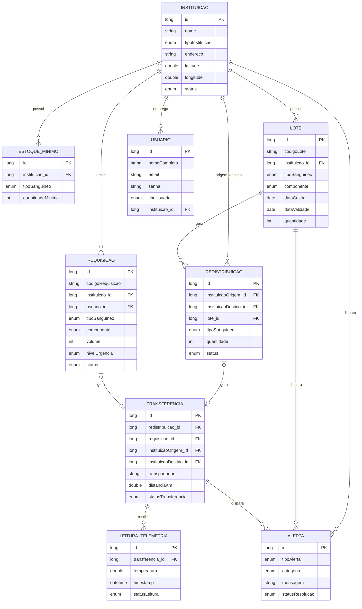

# 🗂️ Diagrama de Entidades e Relacionamentos — Código Vermelho

Este diagrama representa as entidades do domínio, seus atributos e os relacionamentos entre elas, com as respectivas cardinalidades.

---

## 📎 Legenda de cardinalidade (notação Mermaid)

| Símbolo | Significado |
|---|---|
| `\|\|` | Exatamente um (obrigatório) |
| `\|o` | Zero ou um (opcional) |
| `o{` | Zero ou muitos |
| `\|{` | Um ou muitos |

Exemplo: `INSTITUICAO \|\|--o{ LOTE : possui` → uma Instituição possui zero ou muitos Lotes.