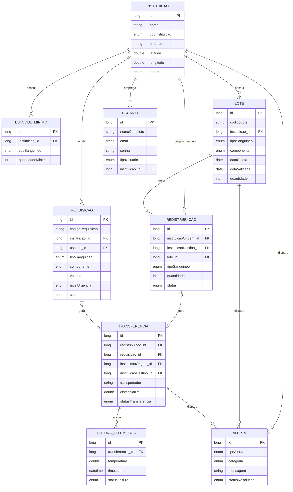

# 🗂️ Diagrama de Entidades e Relacionamentos (ERD) — Rota Vital / Código Vermelho

> ⚠️ **Este é o Modelo de Dados (ERD)** — representa **o que será persistido no banco de dados**: entidades, atributos, chaves primárias/estrangeiras (`PK`/`FK`) e cardinalidades. É diferente do **Modelo de Domínio conceitual**, que representa os conceitos e regras do negócio antes de decidir o que vira tabela (ver [`MODELO_DOMINIO.md`](MODELO_DOMINIO.md)).
>
> Por exemplo: `Rota` é um conceito central do domínio (origem → destino → distância), mas **não aparece neste ERD** porque a decisão do projeto foi não persistir rotas — elas são calculadas em tempo real pelo algoritmo de Dijkstra a partir de estruturas de grafo (`Node`/`Edge`/`Graph`), e não uma tabela do banco. Isso está detalhado no `MODELO_DOMINIO.md` e em [`USO_RESULTADO_ROTA.md`](USO_RESULTADO_ROTA.md).

Este diagrama representa as entidades do domínio, seus atributos e os relacionamentos entre elas, com as respectivas cardinalidades.

> 💡 O código abaixo está em [Mermaid](https://mermaid.js.org/) (`erDiagram`). O GitHub renderiza este bloco automaticamente como uma imagem ao visualizar este arquivo no navegador — não precisa de nenhuma ferramenta extra para ver o desenho.

---

## 📎 Legenda de cardinalidade (notação Mermaid)

| Símbolo | Significado |
|---|---|
| `\|\|` | Exatamente um (obrigatório) |
| `\|o` | Zero ou um (opcional) |
| `o{` | Zero ou muitos |
| `\|{` | Um ou muitos |

Exemplo: `INSTITUICAO \|\|--o{ LOTE : possui` → uma Instituição possui zero ou muitos Lotes.